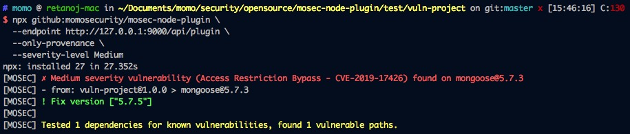

# MOSEC-NODE-PLUGIN

用于检测 node 项目的第三方依赖组件是否存在安全漏洞。

该项目是基于 [snyk/resolve-deps](https://github.com/snyk/resolve-deps.git) 的二次开发。


## 关于我们

Website：https://security.immomo.com

WeChat:

<br>


## 版本要求

npm >= 5.2.0


## 使用

首先运行 [MOSEC-X-PLUGIN Backend](https://github.com/momosecurity/mosec-x-plugin-backend.git)

#### 无需安装即可使用
```
> cd your_node_project/
> npx github:momosecurity/mosec-node-plugin \
  --endpoint http://127.0.0.1:9000/api/plugin \
  --only-provenance
```


## 帮助

```shell script
$ npx github:momosecurity/mosec-node-plugin --help

Usage: mosec [options]

Options:
  -V, --version                 output the version number
  -e, --endpoint <value>        上报API
  -t, --target <path>           项目所在目录 (default: current dir)
  -s, --severity-level <value>  威胁等级 [High|Medium|Low] (default: "High")
  --only-provenance             仅检查直接依赖 (default: false)
  --with-dev                    包括devDependency (default: false)
  -h, --help                    display help for command
```


## 使用效果

以 test/vuln-project 项目为例。

红色部分给出漏洞警告，Path: 为漏洞依赖链，Fix version 为组件安全版本。




## 检测原理

MOSEC-NODE-PLUGIN首先会读取package.json文件并解析出项目声明需求的依赖。

之后会递归解析node_modules目录，提取当前项目安装的依赖。如有必要，还会逐级向上层目录查找node_modules目录。

最后进行声明依赖与实际安装依赖的比对，并构造当前项目的依赖树。

最终依赖树会交由 [MOSEC-X-PLUGIN-BACKEND](https://github.com/momosecurity/mosec-x-plugin-backend.git) 检测服务进行检测，并返回结果。

相关数据结构请参考 MOSEC-X-PLUGIN-BACKEND [README.md](https://github.com/momosecurity/mosec-x-plugin-backend/blob/master/README.md).
